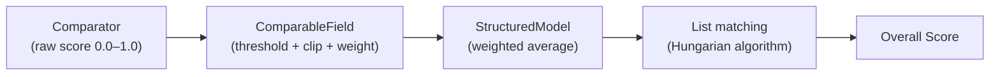

# Customizing Your Evaluation

Stickler gives you fine-grained control over how every field in your structured data is compared. You can tune comparison algorithms, thresholds, and weights at the field level -- whether you define your models in Python or through JSON Schema configuration files.

This guide covers three ways to configure evaluation behavior:

1. **ComparableField parameters** in Python model definitions
2. **The `compare_with()` method** for running comparisons
3. **JSON Schema extensions** for configuration-driven evaluation

!!! tip "Evaluating a test set?"
    If you need to evaluate many document pairs (not just one), use **`BulkStructuredModelEvaluator`** — it handles streaming aggregation, progress reporting, and metrics export. See the [Bulk Evaluation](bulk-evaluation.md) guide.

!!! tip "Evaluating confidence scores?"
    If your model produces confidence scores alongside predictions, see the [Confidence Evaluation](confidence-evaluation.md) guide for AUROC, Brier Score, ECE, and Error Capture at Review Budget metrics.

---

## How Evaluation Works

Stickler evaluates structured data from the inside out. At the innermost layer, **Comparators** compute a raw similarity score (0.0–1.0) between two primitive values. Each **ComparableField** wraps a comparator with a threshold and weight — scores below the threshold are clipped to zero, and weights control how much the field matters. **StructuredModels** aggregate field scores into a weighted average. For list fields, the **Hungarian algorithm** finds the optimal one-to-one pairing between ground truth and prediction items before scoring.



---

## ComparableField Parameters

When defining a `StructuredModel` subclass in Python, each field is declared with `ComparableField(...)`. This function accepts comparison parameters that control how that specific field is evaluated.

### Parameter Reference

| Parameter | Type | Default | Description |
|-----------|------|---------|-------------|
| `comparator` | `BaseComparator` | `LevenshteinComparator()` | The comparison algorithm to use. See [Comparators](../Comparators/README.md) for the full list. |
| `threshold` | `float` (0.0--1.0) | `0.5` | Minimum similarity score required for a field to be classified as a match. |
| `weight` | `float` (> 0.0) | `1.0` | Relative importance of this field when computing aggregate scores. |
| `clip_under_threshold` | `bool` | `True` | When `True`, scores below `threshold` are zeroed out before contributing to the weighted average. |
| `aggregate` | `bool` | `False` | *Deprecated.* Previously controlled inclusion in parent-level metrics. All nodes now include an automatic `aggregate` field in the confusion matrix output. |

### How Each Parameter Affects Scoring

**`comparator`** -- Determines which algorithm computes the raw similarity score between two field values. Different comparators suit different data types:

- `LevenshteinComparator` for names and addresses (edit-distance based)
- `ExactComparator` for IDs and codes (binary match)
- `NumericComparator` for prices and quantities (tolerance-based)
- `FuzzyComparator` for descriptions (token-based, order-independent)

See the [Comparators](../Comparators/README.md) section for the complete list and detailed descriptions.

**`threshold`** -- Acts as a binary classification cutoff. A similarity score at or above the threshold counts as a True Positive; below it counts as a False Discovery. Choose stricter thresholds (0.9--1.0) for critical fields and looser thresholds (0.5--0.7) for flexible fields.

**`weight`** -- Controls how much a field contributes to the overall score. The overall score is computed as:

```
overall_score = sum(field_score * weight) / sum(weights)
```

Fields with higher weights pull the overall score toward their individual result.

**`clip_under_threshold`** -- When enabled (the default), a field that scores below its threshold contributes 0.0 to the weighted average instead of its partial similarity. This prevents low-confidence matches from inflating the overall score.

### Example Model

```python
from stickler.comparators.levenshtein import LevenshteinComparator
from stickler.comparators.exact import ExactComparator
from stickler.comparators.numeric import NumericComparator
from stickler.comparators.fuzzy import FuzzyComparator
from stickler.structured_object_evaluator.models.comparable_field import ComparableField
from stickler.structured_object_evaluator.models.structured_model import StructuredModel


class Invoice(StructuredModel):
    invoice_id: str = ComparableField(
        comparator=ExactComparator(),  # Must match exactly
        threshold=1.0,
        weight=3.0,                    # Highest weight — wrong ID = wrong customer
        clip_under_threshold=True,
    )

    customer_name: str = ComparableField(
        comparator=LevenshteinComparator(),  # Tolerates typos
        threshold=0.8,
        weight=1.5,
    )

    total_amount: float = ComparableField(
        comparator=NumericComparator(),  # Tolerance-based numeric comparison
        threshold=0.95,
        weight=2.5,
    )

    notes: str = ComparableField(
        comparator=FuzzyComparator(),  # Low threshold, minimal weight — cosmetic field
        threshold=0.6,
        weight=0.3,
    )
```

---

## The `compare_with()` Method

Once you have two model instances -- a ground truth and a prediction -- call `compare_with()` to evaluate them.

### Basic Usage

```python
result = ground_truth.compare_with(prediction)

print(f"Overall score: {result['overall_score']:.2%}")
print(f"All fields matched: {result['all_fields_matched']}")

for field, score in result['field_scores'].items():
    print(f"  {field}: {score:.3f}")
```

The default output contains three keys:

- **`overall_score`** (float) -- Weighted average of all field scores (0.0 to 1.0).
- **`field_scores`** (dict) -- Maps each field name to its similarity score.
- **`all_fields_matched`** (bool) -- `True` when every field meets or exceeds its threshold.

### Key Parameters

| Parameter | Type | Default | What It Enables |
|-----------|------|---------|-----------------|
| `include_confusion_matrix` | `bool` | `False` | Adds a `confusion_matrix` key with TP/FP/TN/FN/FD/FA counts and derived precision, recall, F1, and accuracy metrics at both the overall and field levels. |
| `document_non_matches` | `bool` | `False` | Adds a `non_matches` list with details about every field that failed to match, including the field path, non-match type, both values, and a human-readable reason. |
| `document_field_comparisons` | `bool` | `False` | Adds a `field_comparisons` list documenting every field-level comparison (both matches and non-matches) with expected/actual keys and values, scores, and reasons. |
| `add_confidence_metrics` | `bool` | `False` | Adds an `auroc_confidence_metric` for evaluating confidence calibration. |
| `evaluator_format` | `bool` | `False` | Restructures the output for bulk evaluation integration. See [Evaluator Format](#evaluator-format) below. |

### Example with Detailed Metrics

```python
result = ground_truth.compare_with(
    prediction,
    include_confusion_matrix=True,
    document_non_matches=True,
)

# Overall score
print(f"Score: {result['overall_score']:.3f}")

# Confusion matrix totals
cm = result['confusion_matrix']['aggregate']
print(f"Precision: {cm['derived']['cm_precision']:.3f}")
print(f"Recall:    {cm['derived']['cm_recall']:.3f}")
print(f"F1:        {cm['derived']['cm_f1']:.3f}")

# Inspect non-matches for debugging
for nm in result.get('non_matches', []):
    print(f"  {nm['field_path']}: {nm['non_match_type']} "
          f"(score={nm['similarity_score']:.3f})")
```

---

## JSON Schema Extensions

For configuration-driven evaluation -- where you want to define models and comparison logic without writing Python code -- Stickler supports standard JSON Schema (Draft 7+) with custom `x-aws-stickler-*` extensions.

### Extension Reference

Add these extensions to any property in your JSON Schema to control comparison behavior:

| Extension | Type | Default | Purpose |
|-----------|------|---------|---------|
| `x-aws-stickler-comparator` | string | Type-dependent | Comparison algorithm (e.g., `"ExactComparator"`, `"LevenshteinComparator"`) |
| `x-aws-stickler-threshold` | number (0.0--1.0) | 0.5 or 1.0 | Match classification cutoff |
| `x-aws-stickler-weight` | number (> 0.0) | 1.0 | Field importance multiplier |
| `x-aws-stickler-clip-under-threshold` | boolean | `false` | Zero out scores below threshold |
| `x-aws-stickler-aggregate` | boolean | `false` | Include in parent-level aggregate metrics |
| `x-aws-stickler-model-name` | string | `"DynamicModel"` | Name of the generated Python class (root level) |
| `x-aws-stickler-match-threshold` | number (0.0--1.0) | 0.7 | Model-level matching threshold for Hungarian algorithm (root level) |

### Example Schema

```json
{
  "type": "object",
  "x-aws-stickler-model-name": "Invoice",
  "x-aws-stickler-match-threshold": 0.75,
  "properties": {
    "invoice_id": {
      "type": "string",
      "x-aws-stickler-comparator": "ExactComparator",
      "x-aws-stickler-threshold": 1.0,
      "x-aws-stickler-weight": 3.0,
      "x-aws-stickler-clip-under-threshold": true
    },
    "customer_name": {
      "type": "string",
      "x-aws-stickler-comparator": "LevenshteinComparator",
      "x-aws-stickler-threshold": 0.8,
      "x-aws-stickler-weight": 1.5
    },
    "total_amount": {
      "type": "number",
      "x-aws-stickler-comparator": "NumericComparator",
      "x-aws-stickler-threshold": 0.95,
      "x-aws-stickler-weight": 2.5
    }
  },
  "required": ["invoice_id", "customer_name", "total_amount"]
}
```

### Loading a Schema

```python
from stickler.structured_object_evaluator.models.structured_model import StructuredModel
import json

with open("invoice_schema.json") as f:
    schema = json.load(f)

Invoice = StructuredModel.from_json_schema(schema)

ground_truth = Invoice(**{"invoice_id": "INV-001", "customer_name": "Acme Corp", "total_amount": 1250.00})
prediction = Invoice(**{"invoice_id": "INV-001", "customer_name": "ACME Corporation", "total_amount": 1250.00})

result = ground_truth.compare_with(prediction)
print(f"Overall Score: {result['overall_score']:.3f}")
```

??? example "Sample Output"

    ```json
    {
      "field_scores": {
        "invoice_id": 1.0,
        "customer_name": 0.0,
        "total_amount": 1.0
      },
      "overall_score": 0.786,
      "all_fields_matched": false
    }
    ```

    Note that `customer_name` scores 0.0: "Acme Corp" vs "ACME Corporation" produces a Levenshtein similarity below the 0.8 threshold, so `clip_under_threshold` zeros it out.

For the complete reference on all extensions, default comparators by type, and a full production example, see the [JSON Schema Extensions](https://github.com/awslabs/stickler#json-schema-extensions-x-aws-stickler--complete-reference) section in the project README.

---

## Evaluator Format

When you need output structured for bulk evaluation pipelines, pass `evaluator_format=True`. This restructures the result into a format optimized for aggregation.

```python
result = ground_truth.compare_with(prediction, evaluator_format=True)
```

The output changes to:

```json
{
  "overall": {
    "precision": 0.83,
    "recall": 1.0,
    "f1": 0.91,
    "accuracy": 0.83,
    "anls_score": 0.83
  },
  "fields": {
    "invoice_id": { "precision": 1.0, "recall": 1.0, "f1": 1.0, "accuracy": 1.0, "anls_score": 1.0 },
    "customer_name": { "precision": 1.0, "recall": 1.0, "f1": 1.0, "accuracy": 1.0, "anls_score": 0.85 }
  },
  "confusion_matrix": {},
  "non_matches": []
}
```

Key differences from the default output:

- The top-level key is `overall` (a dict of metrics), not `overall_score` (a float).
- Each field in `fields` contains precision, recall, F1, accuracy, and ANLS score.
- The `confusion_matrix` and `non_matches` keys are present but empty in this format.

This format is what `BulkStructuredModelEvaluator` expects when aggregating results across many documents.

---

## Next Steps

- [Bulk Evaluation](bulk-evaluation.md) -- Evaluate hundreds or thousands of document pairs with memory-efficient streaming.
- [Understanding Results](understanding-results.md) -- Learn how to read confusion matrices, derived metrics, and non-match reports.
