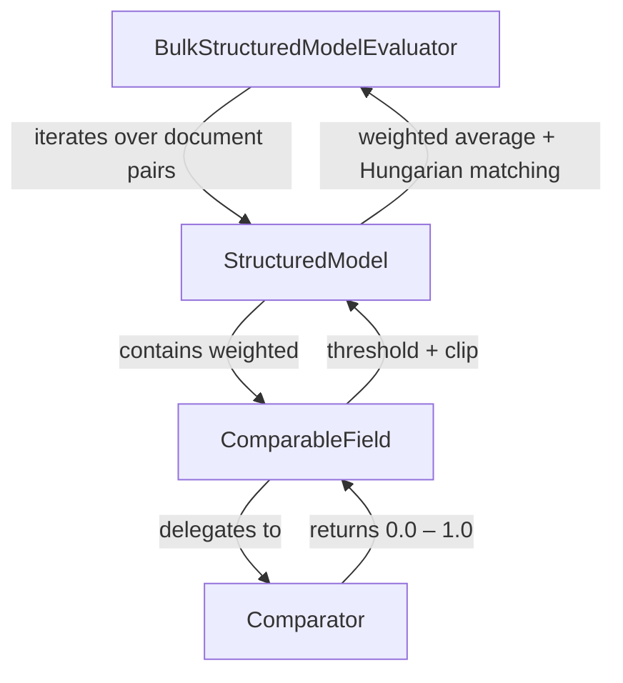

# Stickler Documentation

Stickler is a Python library for structured JSON comparison and evaluation, built for generative AI workflows. It uses specialized comparators, business-weighted scoring, and the Hungarian algorithm to tell you not just whether your AI output is accurate, but whether the errors actually matter.

### Key Use Case: Key Information Extraction (KIE)

Generative AI models extract structured data from documents — invoices, forms, receipts, medical records. But how accurate is the extraction? And do the errors actually matter? Stickler answers both questions by comparing AI output against ground truth with field-level precision, business-weighted scoring, and optimal list matching.

```python
from stickler import StructuredModel, ComparableField
from stickler.comparators import ExactComparator, NumericComparator

# 1. Define what "correct" looks like — each field gets its own comparator and weight
class Invoice(StructuredModel):
    invoice_id: str = ComparableField(comparator=ExactComparator(), weight=3.0)   # Must match perfectly, high weight
    total: float = ComparableField(comparator=NumericComparator(tolerance=0.01), weight=2.0)  # Allow rounding
    vendor: str = ComparableField(weight=1.0)  # Fuzzy text match by default

# 2. Compare ground truth vs AI prediction
gt = Invoice(invoice_id="INV-001", total=1250.00, vendor="Acme Corp")
pred = Invoice(invoice_id="INV-001", total=1250.00, vendor="ACME Corporation")
result = gt.compare_with(pred)

# 3. Get a single weighted score + per-field breakdown
print(f"Score: {result['overall_score']:.3f}")  # 0.786
print(result['field_scores'])
# {'invoice_id': 1.0, 'total': 1.0, 'vendor': 0.786}
```

---

## How Stickler Works

Stickler uses a layered architecture where each layer builds on the one below it. **Comparators** handle primitive value comparison (exact, numeric, fuzzy, semantic). **ComparableFields** attach a comparator, threshold, and weight to each field. **StructuredModels** compose fields into nested, evaluation-aware data structures with Hungarian list matching. **BulkStructuredModelEvaluator** aggregates results across an entire test set.



---

<div class="grid cards" markdown>

-   **Getting Started**

    ---

    Installation, quick start, and your first evaluation in 30 seconds.

    [:octicons-arrow-right-24: Get started](Getting-Started/README.md)

-   **Comparators**

    ---

    Exact, numeric, fuzzy, semantic, and LLM-based comparison algorithms.

    [:octicons-arrow-right-24: Choose a comparator](Guides/Comparators/README.md)

-   **Evaluation**

    ---

    Thresholds, weights, clipping, JSON Schema config, and bulk evaluation.

    [:octicons-arrow-right-24: Customize evaluation](Guides/Evaluation/README.md)

-   **Use Cases**

    ---

    Document extraction, OCR, entity extraction, ML evaluation, and ETL validation.

    [:octicons-arrow-right-24: See patterns](Guides/Use-Cases/README.md)

-   **Best Practices**

    ---

    Threshold tuning, SME calibration, weight assignment, and performance.

    [:octicons-arrow-right-24: Learn more](Guides/Best-Practices/README.md)

-   **Advanced**

    ---

    Hungarian algorithm internals, recursive engine, and custom comparators.

    [:octicons-arrow-right-24: Go deeper](Advanced/README.md)

-   **API Reference**

    ---

    Complete documentation for all classes, methods, and configuration.

    [:octicons-arrow-right-24: Browse API](API-Reference/README.md)

-   **Contributing**

    ---

    Report issues, submit pull requests, and development setup.

    [:octicons-arrow-right-24: Contribute](Getting-Started/Contributing/README.md)

</div>
